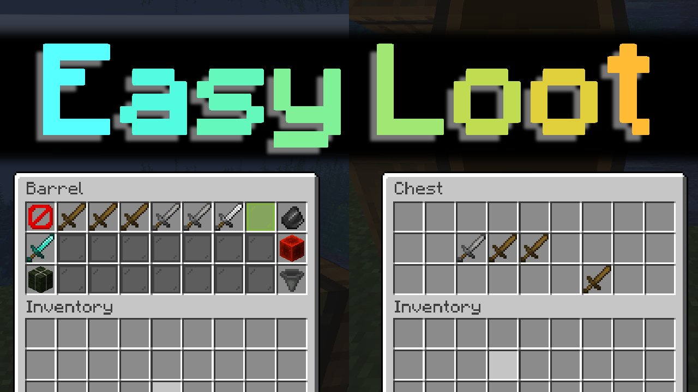

# Easy Loot (Minecraft Datapack)
<!-- ALL-CONTRIBUTORS-BADGE:START - Do not remove or modify this section -->
[](#contributors-)
[](https://discord.gg/AsHA7GgqqM)
[](https://www.youtube.com/watch?v=MhSg40o8HUc)
[](https://github.com/CloudWolfYT/ShaderSelectorV2/releases)

<!-- ALL-CONTRIBUTORS-BADGE:END -->


## How to Use 📝
<!-- prettier-ignore-start -->
<!-- markdownlint-disable -->
To use this pack, place it in your datapacks folder and type /reload in your world. Make sure that the shulker box is placed at 0 -64 0, and click the tellraw to place the UI. In the UI, place an item on the main page where the lime stained glass is to make a loot table, then inside the loot table place items on the lime stained glass to add items and click those items to remove them. The amount of an item dictates its weight, or how common it is. To use the loot table you can either have the items drop/spawn or placed in a chest. To have the drop/spawn use a decorated pot with the proper custom data. You can get an example item by clicking the button on far left side of the UI. To place a chest you can either spawn a chest with the custom data, rotated how you want the chest to face, or drop a chest with the same data. <br>
<!-- markdownlint-enable -->
```
give @p decorated_pot[custom_data:{ezl:[{idx:0,count:3},{idx:1,count:2}]}]
```
<!-- markdownlint-disable -->
<!-- markdownlint-enable -->
```
give @p chest[custom_data:{ezl:[{idx:0,count:3},{idx:1,count:2}]}]
```
<!-- markdownlint-disable -->
<!-- markdownlint-enable -->
<!-- prettier-ignore-end -->

## How it Works! 🔨
<!-- prettier-ignore-start -->
<!-- markdownlint-disable -->
The items placed in the user interface are used to make a valid loot table inside of data storage which is then used with a macro in the command "/loot spawn ~ ~ ~ loot $(table)"<br>
<!-- markdownlint-enable -->
<!-- prettier-ignore-end -->

## Contributors 🧱
<!-- prettier-ignore-start -->
<!-- markdownlint-disable -->
<table>
  <tr>
    <td align="center"><a href="https://github.com/CloudWolfYT"><br /><sub><b>Cloud Wolf</b></sub></a><br /><a href="#" title="Project Creator">🔨</a></td>
  </tr>
</table>

<!-- markdownlint-enable -->
<!-- prettier-ignore-end -->
